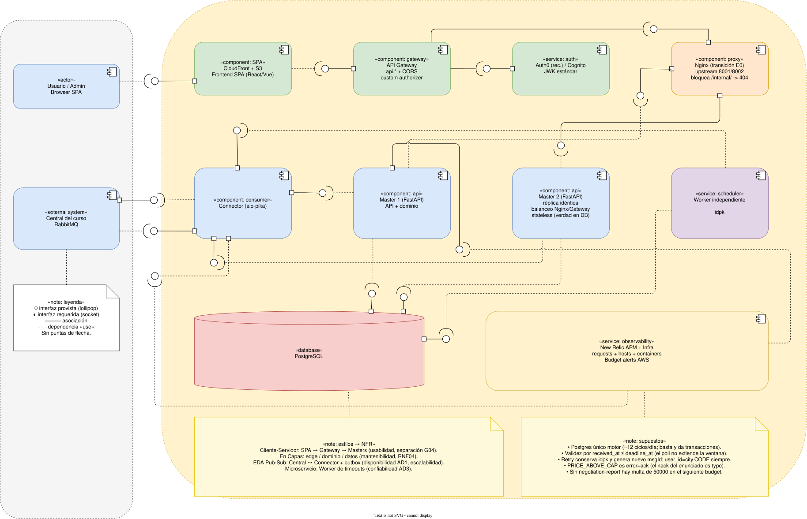

# Flujo de Arquitectura

Resumen conciso del flujo componente a componente basado en [UML_E1.drawio](UML_E1.drawio).

---

## 1. Mapeo de Cajitas (Componentes)

| Cajita | Tipo | Rol en el flujo |
|---|---|---|
| **Usuario / Admin** | `«actor»` | Consulta vistas públicas y gestiona propuestas desde el navegador. |
| **CloudFront + S3** | `«component: SPA»` | Aloja y distribuye la aplicación frontend estática (React/Vue). |
| **API Gateway** | `«component: gateway»` | Punto de entrada único HTTPS (`api.*`), gestiona CORS y rutea tráfico. |
| **Auth0 / Cognito** | `«service: auth»` | Valida credenciales y provee llaves públicas (JWK) para verificar JWT. |
| **Nginx** | `«component: proxy»` | Balanceador reverse proxy hacia masters; bloquea acceso externo a `/internal/`. |
| **Master 1** | `«component: api»` | Servicio FastAPI: expone API pública y endpoint `/internal/events`, aplica lógica de negocio. |
| **Master 2** | `«component: api»` | Réplica stateless idéntica de Master 1 para balanceo y alta disponibilidad. |
| **PostgreSQL** | `«database»` | Única fuente de verdad: registra mensajes, ledger transaccional, ciclo, operaciones y outbox. |
| **Central del curso** | `«external system»` | Broker RabbitMQ externo donde corre la cola `city.CODE`. |
| **Connector** | `«component: consumer»` | Proceso `aio-pika` que conecta con RabbitMQ: ingesta eventos y publica mensajes outbox. |
| **Worker independiente**| `«service: scheduler»`| Proceso en segundo plano que sondea deadlines vencidos y agenda reintentos. |
| **New Relic APM + Infra**| `«service: observability»` | Agente transversal que monitorea métricas, consumo de recursos y salud de contenedores. |

---

## 2. Flujo Completo Integrando

### Paso a Paso:

1. **Interacción del Usuario:**
   - **Usuario / Admin** carga la app desde **CloudFront + S3**.
   - Envía peticiones a **API Gateway**, el cual delega la validación del token JWT a **Auth0 / Cognito**.
   - Peticiones válidas pasan a **Nginx**, que balancea el tráfico entre **Master 1** y **Master 2**.
   - **Master 1/2** resuelven consultas (historial, estado de ciclo) leyendo directamente de **PostgreSQL**.

2. **Ingesta desde la Central (Entrada):**
   - **Central del curso** publica eventos en la cola RabbitMQ.
   - **Connector** consume el mensaje y hace `POST /internal/events` hacia **Master 1** o **Master 2** (red privada).
   - El **Master** correspondiente valida la estructura, persiste el evento en **PostgreSQL** (ledger y message_log) y responde `200 OK`.
   - Tras el `200 OK`, el **Connector** confirma el `ACK` a la **Central del curso**.

3. **Gestión de Timeouts y Publicación (Salida):**
   - **Worker independiente** hace polling cada ~5s a **PostgreSQL** buscando operaciones con `deadline_at` expirado.
   - Si una operación vence, el **Worker** programa un reintento (mismo `idpk`, nuevo `msgId`) en la tabla outbox de **PostgreSQL**.
   - **Connector** lee los mensajes pendientes del outbox y los publica hacia la **Central del curso** (propuestas, transferencias o reportes).

4. **Monitoreo Transversal:**
   - **New Relic APM + Infra** recopila trazas HTTP de **Master 1/2**, latencias del **Connector** y estado del host EC2/Docker.
